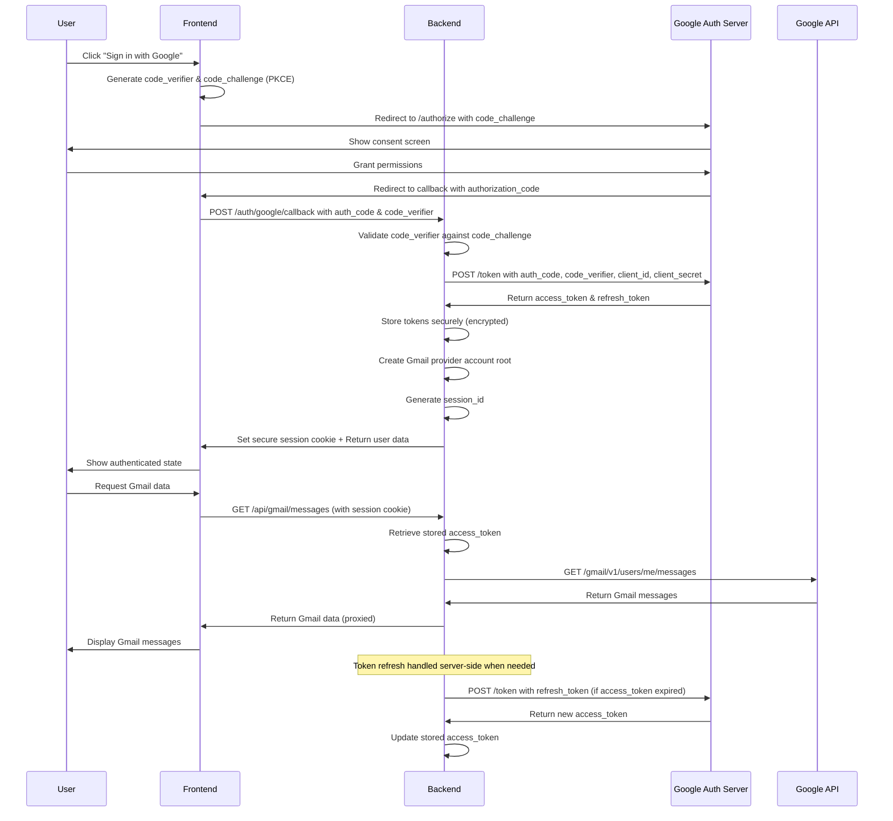

# Design: Google Sign‑In for MailEngine

## Overview
Implement OAuth 2.0 Authorization Code flow with PKCE to securely obtain Google access and refresh tokens. The frontend triggers authentication and the backend performs the server‑side token exchange. After successful sign‑in, the backend issues a secure session cookie and creates a Gmail provider account root. All Google API calls are proxied through the backend using stored tokens, never exposing tokens to the browser.

This design supports MailEngine’s long‑term goals:
- Local‑first architecture
- Provider‑agnostic account model
- Multi‑account support
- Secure token lifecycle management
- Future expansion to Outlook, IMAP, and desktop clients




---

## Folder Structure (Google Auth Feature)

The Google Sign‑In feature introduces new backend and frontend components.  
This structure isolates Google authentication logic, supports provider‑agnostic expansion, and keeps the implementation aligned with existing MailEngine architecture.

```
src/
  MailEngine.Server/
    Controllers/
      GoogleAuthController.cs
      GoogleDemoController.cs

    Services/
      GoogleAuth/
        IGoogleAuthService.cs
        GoogleAuthService.cs
        GooglePkceService.cs
        GoogleStateService.cs

      GoogleTokens/
        IGoogleTokenStore.cs
        GoogleTokenStore.cs

      GoogleAccounts/
        IGoogleProviderAccountService.cs
        GoogleProviderAccountService.cs

    Models/
      Auth/
        GoogleAuthState.cs
        GoogleTokenResponse.cs
        GoogleUserInfo.cs

    Configuration/
      GoogleAuthOptions.cs

    appsettings.json
    appsettings.Development.json

  frontend/
    mailbox-app/
      src/
        pages/
          LoginPage.tsx

        store/
          useAuthStore.ts

        router/
          index.tsx

        api/
          googleAuthApi.ts
          googleDemoApi.ts

        components/
          GoogleSignInButton.tsx
```
# Components

## Frontend
- `LoginPage.tsx` (new): Material Design login UI with Google Identity Services (GIS) button.
- `auth` store/hook: tracks session state, active provider account, and logout/disconnect actions.
- Router: redirects unauthenticated users to `/login`.
- Consent explanation: displays requested Google scopes and why they are needed.
- Optional: show connected Gmail accounts and allow adding additional accounts.

## Backend (MailEngine.Server)
- `GoogleAuthController` (new):
  - `GET /auth/google/start` — generates PKCE, state, and redirect URL.
  - `GET /auth/google/callback` — validates state, exchanges code for tokens, creates provider account root, sets session cookie.
  - `POST /auth/logout` — clears session cookie.
  - `DELETE /auth/google/disconnect` — revokes tokens and deletes provider account root.
- `GoogleAuthService` (new):
  - PKCE generation and validation.
  - State and nonce generation/validation.
  - Token exchange and refresh logic.
  - Revocation detection.
- `GoogleTokenStore` (new):
  - Encrypted refresh token storage.
  - In‑memory access token handling.
  - Token rotation and revocation support.
- Provider account root:
  - `/accounts/gmail/{googleUserId}/`
  - Stores tokens, sync metadata, raw MIME storage, and provider config.
- Config additions:
  - `Google:ClientId`
  - `Google:ClientSecret`
  - `Google:RedirectUri`

---

# OAuth Flow (Detailed)

1. **Frontend → `/auth/google/start`**  
   Backend generates:
   - PKCE `code_verifier` and `code_challenge`
   - `state` and `nonce`
   - Stores them in a short‑lived server store (session or memory cache)
   - Returns Google authorization URL

2. **User completes Google consent**  
   Scopes requested:
   - `https://mail.google.com/`
   - `https://www.googleapis.com/auth/calendar`
   - `https://www.googleapis.com/auth/contacts`
   - `https://www.googleapis.com/auth/drive`

3. **Google → `/auth/google/callback?code=...&state=...`**  
   Backend:
   - Validates `state`
   - Exchanges `code` + `code_verifier` for tokens
   - Extracts Google account ID and email

4. **Backend creates provider account root**  
   Path: `/accounts/gmail/{googleUserId}/`  
   Stores:
   - `tokens.json` (encrypted refresh token)
   - Sync metadata
   - Raw MIME storage folder
   - Provider configuration

5. **Backend issues session cookie**  
   Cookie properties:
   - HTTP‑only
   - SameSite=Strict
   - Secure (in production)
   - Contains only a session identifier, not tokens

6. **Frontend authenticated**  
   Frontend can now call backend endpoints that proxy Google API calls using stored tokens.

---

# Provider Abstraction Model

Google Sign‑In is implemented as the **Gmail provider**, not a global login system.

- Each Gmail account is a separate provider account root.
- Future providers (Outlook, IMAP) will follow the same pattern.
- Frontend should treat Gmail accounts as independent identities.
- Backend must support multiple provider accounts simultaneously.

This ensures MailEngine remains provider‑agnostic and scalable.

---

# Token Storage & Security

## Storage Model
- Refresh tokens stored encrypted at rest:
  - `/accounts/gmail/{googleUserId}/tokens.json`
- Access tokens:
  - Stored in memory only
  - Never written to disk
  - Never exposed to the browser

## Encryption
- AES‑256 or platform‑native DPAPI
- Keys stored securely (not in repo)

## Token Lifecycle
- Automatic refresh using Google’s token endpoint
- Handle silent refresh token rotation
- Detect revoked tokens (HTTP 401/403 from Google)
- On revocation:
  - Mark account as disconnected
  - Notify frontend

---

# Multi‑Account Support

MailEngine must support multiple Gmail accounts per user.

- Each account has its own:
  - Token set
  - Sync metadata
  - Local storage root
- Frontend:
  - Allow adding additional Gmail accounts
  - Optional account switcher UI
- Backend:
  - Session cookie identifies active provider account
  - All API calls routed through the correct provider root

---

# Redirect URI Strategy

Add the following redirect URIs to Google Cloud:

### Local development
- http://webfrontend-mailengine.dev.localhost:55459/auth/google/callback
- https://server-mailengine.dev.localhost:7416/
